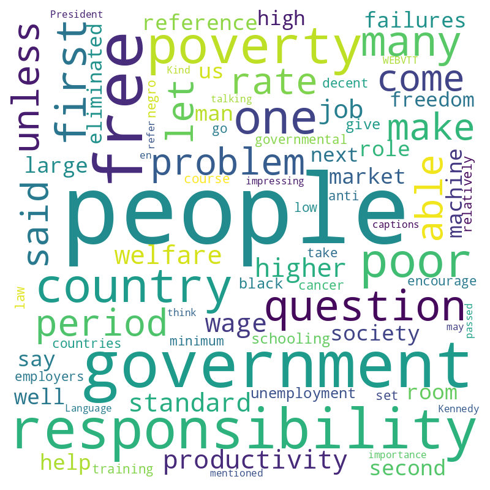
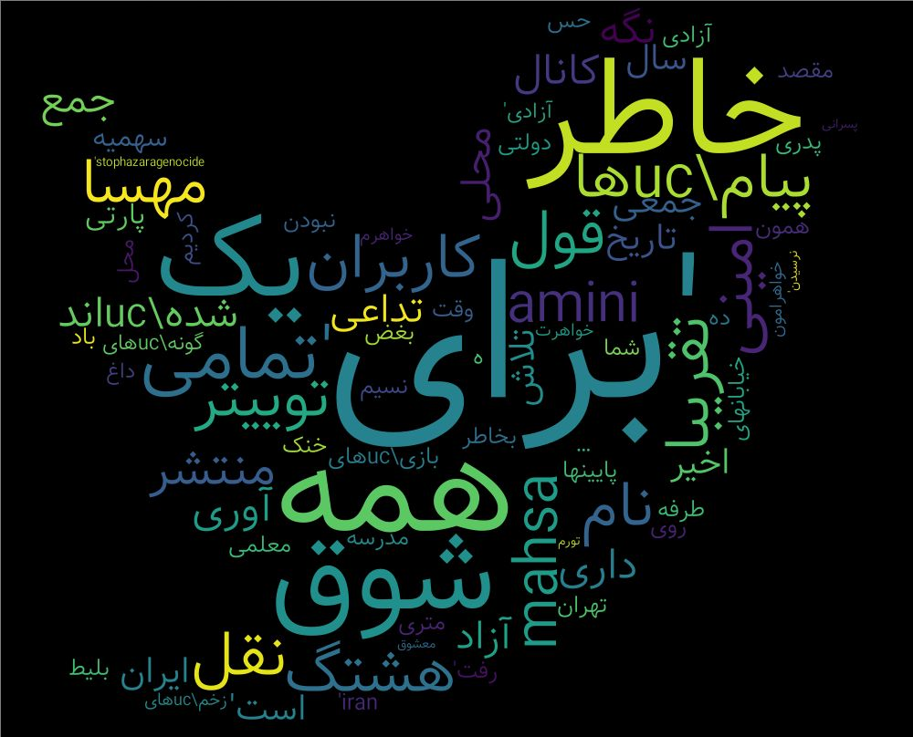

## Manifesto

The idea is creating wordcloud for YouTube videos, and then Medium articles as well. I copied the idea from [this guy](https://www.param.me/videocloud/) btw.
I used word_cloud from PyPi, lots of thanks to [amueller](https://github.com/amueller/word_cloud) for [his effort](https://peekaboo-vision.blogspot.com/2012/11/a-wordcloud-in-python.html) on this project.

## More

I believe I first learned about wordclouds in 2019 when I noticed my friends utilizing a tool to build them on Twitter. At the time, I thought it was a fun and unique way to see what you were exhibiting on social media. Because I was curious and insecure (government control) at the same time, I did not trust those free services out there that built *Word-Clouds* for Iranian Twitter members because it was easy to store those tweets in a single database and use the metadata inside them, it was like telling someone you don't know your entire life in 3200 tweets, *at least for me*. So I learnt the hard way and then made these clouds for a bunch of my pals who were having the same problem. I also assisted a friend of mine in developing a better version of this nonsense.
Anyway, I'd forgotten about it for years until I saw some PhD students making word clouds out of Iranian tweets for Mahsa Amini a few days ago. I noticed those clouds ridicules and had some spare time, so I created this app that generates word clouds from YouTube movies. I believe that in the future, I will have more time to waste and will add Medium, the New York Times, and all of the other platforms that I use on a daily basis.

## What is it exactly?

A word cloud, on the other hand, is a semi-good or not-bad resource for researchers that may be used to analyze qualitative data in the form of texts. It is beneficial in presentations and other situations. In fact, I use it to determine how leftist someone is by seeing a lot of terms like *inequality, rich and poor people*. It's not the most precise method, but it's quick.

## Why for Youtube?

It allows me to quickly grasp what the video is about; for example, if I see a video of **Milton Friedman** with a large *poverty* in it, I know that this particular video is just some idiot student asking stupid questions.

 A few decades ago, a student inquired about the state's role to combat poverty. This world is fucked. [Watch the video.](https://www.youtube.com/watch?v=Rls8H6MktrA)

 Take a look at this cloud; it's full with words like *Mahsa Amini, for, all, ha (pluralizes Persian words) and even \uc*, indicating that the data isn't nice or clean because the guy didn't know what stopwords are. Whatever, he claims to be a PhD, and I trust him. (: Like that idiotic student in Friedman's video.

## To-Dos
+ [X] Main Objective: Creating Wordclouds (:
+ [X] Flask App:
    + [X] Route /yt for Optional Video
    + [X] Additional Mask
    + [X] Additional STOPWORD
    + [ ] Optional Mask
    + [ ] Delete Tmp Files
+ [ ] Medium Version
+ [ ] All Other Sites including New York Times, Washington Post, The Economist, etc.

Lots of thanks to [Roozbeh Sharifnasab](https://github.com/rsharifnasab/create_word_cloud/tree/master/assets/masks) for his masks. I was too lazy to find these masks.